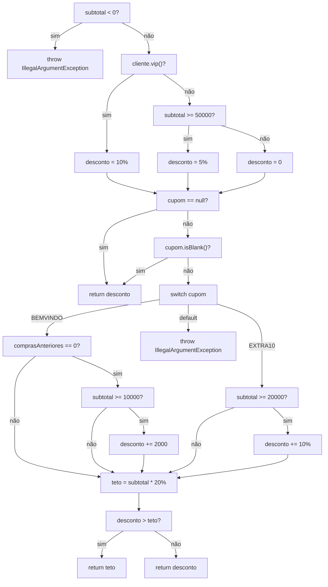
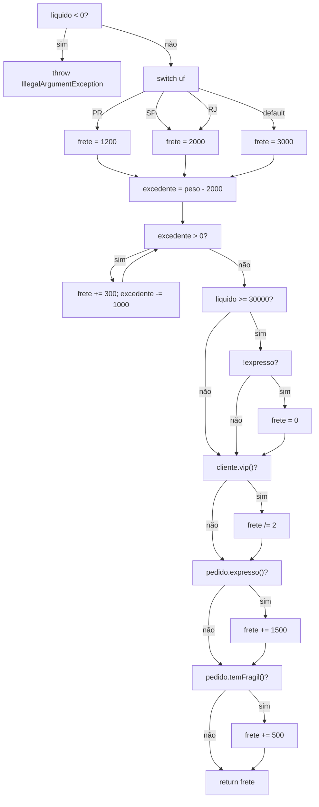
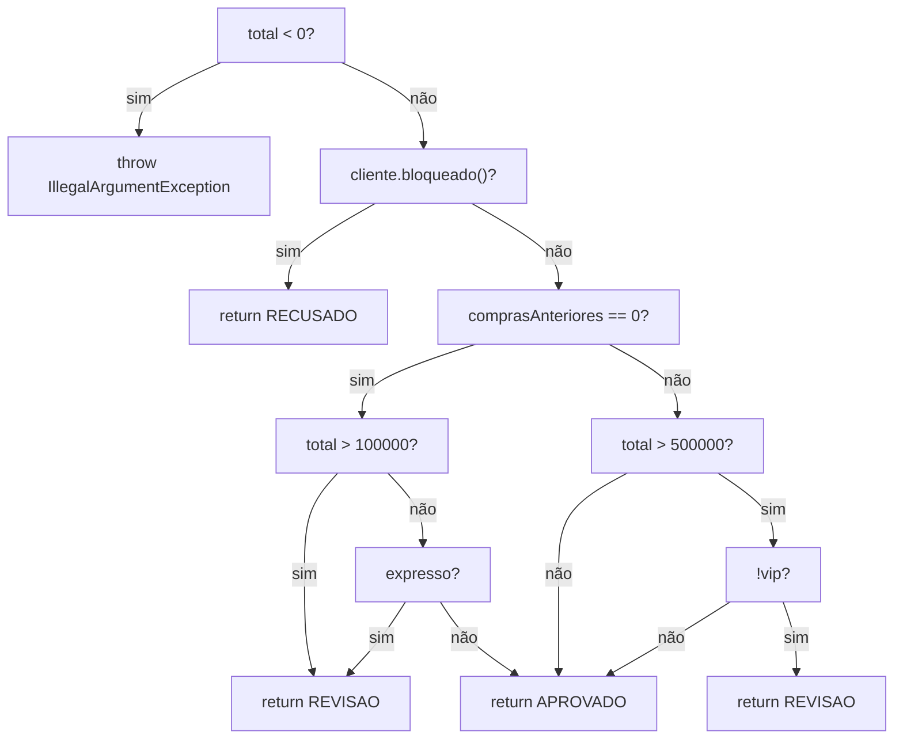
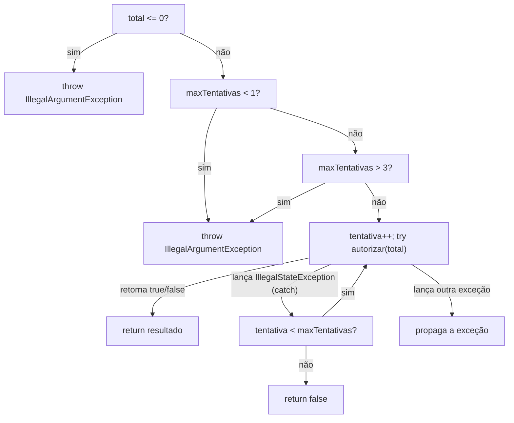
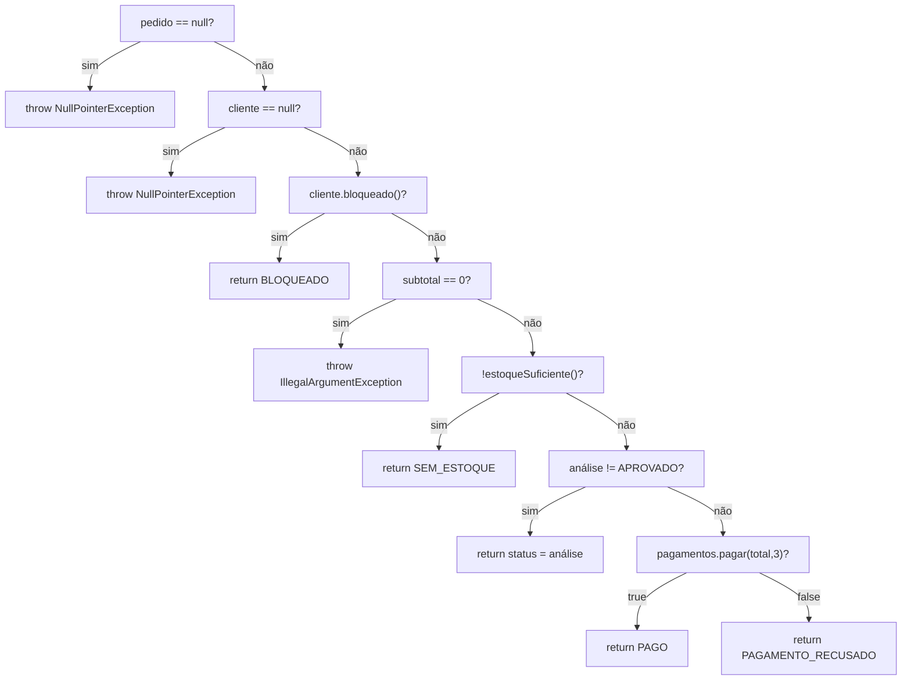

# Relatório do grupo

Integrantes: Gustavo

## Modelo adotado

- **Curto-circuito (`&&` / `||`):** cada operando é tratado como um **nó de decisão separado**, pois o operando à direita só é avaliado se o resultado ainda não estiver definido pelo esquerdo. Isso está declarado explicitamente em cada CFG abaixo (ex.: `cupom == null` e `cupom.isBlank()` são dois nós, não um só).
- **Exceções:** um `throw` é tratado como um nó terminal próprio (saída do grafo), distinto do `return` normal. Em `PagamentoService.pagar`, o bloco `try/catch` gera três saídas possíveis a partir da chamada `processador.autorizar(...)`: retorno normal, captura de `IllegalStateException` (segue o fluxo) e propagação de qualquer outra exceção (sai do método).
- **`switch`:** cada `case` (inclusive quando dois rótulos apontam para o mesmo bloco, como `SP`/`RJ`) conta como uma aresta de decisão distinta a partir do nó de despacho do `switch`.
- **Saída unificada:** cada grafo é tratado como um único componente conectado; múltiplos `return`/`throw` são pontos terminais desse mesmo grafo (não grafos separados).

## Grafos e complexidade

### `PoliticaDesconto.calcular`

### `CalculadoraFrete.calcular`

### `AnaliseRisco.avaliar`

### `PagamentoService.pagar`

### `PedidoService.fechar`

| Método | Nós | Arestas | V(G) | Caminhos independentes | Restrições de viabilidade |
| --- | --- | --- | --- | --- | --- |
| `PoliticaDesconto.calcular` | 22 | 32 | **12** | ver tabela abaixo | Nenhuma restrição: todos os 12 ramos são alcançáveis por combinações de `vip`, `subtotal` e `cupom`. |
| `CalculadoraFrete.calcular` | 20 | 29 | **11** | ver tabela abaixo | O ramo "vip trunca a divisão" (`frete /= 2` com `frete` ímpar) é estruturalmente inalcançável — ver Análise crítica. |
| `AnaliseRisco.avaliar` | 13 | 19 | **8** | ver tabela abaixo | Nenhuma restrição na unidade isolada; porém o ramo `RECUSADO` é inalcançável **via `PedidoService.fechar`** — ver Análise crítica. |
| `PagamentoService.pagar` | 11 | 16 | **7** | ver tabela abaixo | Nenhuma restrição. |
| `PedidoService.fechar` | 15 | 21 | **8** | ver tabela abaixo | Nenhuma restrição alcançável a partir do próprio serviço (as restrições aparecem nas unidades que ele chama). |

## Matriz de testes

Cada linha liga um teste JUnit a um caminho do CFG correspondente (S = sim/verdadeiro na decisão, N = não/falso).

### `PoliticaDescontoTest` (12 caminhos independentes cobertos)

| ID / método JUnit | Caminho (decisões A→S/N) | Resultado esperado | Critério atendido |
| --- | --- | --- | --- |
| `subtotalNegativoLancaExcecao` | A=S | exceção | ramo de validação |
| `vipRecebeDezPorCentoSemCupom` | A=N,C=S,H=S | 10.000 | vip + cupom nulo |
| `clienteComumAbaixoDoLimiarDeCincoPorCentoNaoTemDesconto` | A=N,C=N,E=N,H=S | 0 | comum abaixo do limiar |
| `clienteComumNoLimiteExatoDeCincoPorCento_limiteInferior` | A=N,C=N,E=S,H=S | 2.500 | valor-limite 50.000 |
| `clienteComumAcimaDoLimiarDeCincoPorCento` | A=N,C=N,E=S,H=S | 2.500 | classe acima do limiar |
| `cupomEmBrancoMantemApenasODescontoBase` | A=N,C=N,E=S,H=N,I=S | 2.500 | 2º operando do `\|\|` |
| `cupomBemvindoElegivelNoLimiteDeSubtotal_semComprasAnteriores` | H=N,I=N,K=BEMVINDO,L=S,M=S | 2.000 | switch + `&&` ambos verdadeiros |
| `cupomBemvindoAbaixoDoLimiteDeSubtotalNaoAplica` | L=S,M=N | 0 | 2º operando do `&&` falso |
| `cupomBemvindoComComprasAnterioresNaoElegivel` | L=N | 0 | 1º operando do `&&` falso (curto-circuito) |
| `cupomExtra10ElegivelNoLimiteDeSubtotal` | K=EXTRA10,O=S | 2.000 | valor-limite 20.000 |
| `cupomExtra10AbaixoDoLimiteNaoAplica` | K=EXTRA10,O=N | 0 | classe abaixo do limiar |
| `cupomDesconhecidoLancaExcecao` | K=default | exceção | ramo `default` do switch |
| `descontoCombinadoRespeitaTetoDeVintePorCento` | ...,S=S | 2.000 (capado) | ramo do teto (`>` verdadeiro) |

### `CalculadoraFreteTest` (11 caminhos independentes cobertos, mais variações de valor)

| ID / método JUnit | Caminho | Resultado esperado | Critério atendido |
| --- | --- | --- | --- |
| `valorLiquidoNegativoLancaExcecao` | A=S | exceção | validação |
| `ufParanaUsaTarifaBase` / `ufSaoPauloUsaTarifaIntermediaria` / `ufRioDeJaneiroUsaMesmaTarifaDeSaoPaulo` / `ufOutraUsaTarifaPadrao` | C=PR/SP/RJ/default | 1200/2000/2000/3000 | as 4 arestas do switch |
| `pesoNoLimiteDeDoisQuilosNaoGeraAdicional_zeroIteracoes` | H=N (0 iterações) | 1200 | laço com 0 execuções |
| `umGramaAcimaDoLimiteJaContaUmaIteracaoPorFracao` / `umQuiloExcedenteExatoContaUmaIteracao` | H=S(1x),H=N | 1500 | 1 iteração (fração e exata) |
| `fracaoAcimaDeUmQuiloExcedenteContaSegundaIteracao` | H=S(2x) | 1800 | 2 iterações |
| `tresQuilosExcedentesContamTresIteracoes` | H=S(3x) | 2100 | várias iterações |
| `valorLiquidoNoLimiteZeraFreteBase_entregaNormal` | J=S,K=S,L | 0 | `&&` ambos verdadeiros |
| `valorLiquidoAbaixoDoLimiteNaoZeraFrete` | J=N | 3000 | 1º operando falso |
| `valorLiquidoAltoComEntregaExpressaNaoZeraFrete_segundoOperandoDoAnd` | J=S,K=N | 4500 | 2º operando falso (curto-circuito) |
| `clienteVipPagaMetadeDoFreteBase` | M=S | 1500 | ramo vip |
| `entregaExpressaAcrescentaQuinzeReais` / `itemFragilAcrescentaCincoReais` / `expressaEFragilAcrescentamOsDoisValores` | O=S / Q=S / ambos | 2700/1700/3200 | adicionais isolados e combinados |
| `adicionaisIncidemMesmoQuandoBaseFoiZerada` | L,Q=S | 500 | adicional após gratuidade |
| `combinacaoCompletaVipExpressoFragil_baseNaoZeradaPorSerExpressa` | J=S,K=N,M=S,O=S,Q=S | 3500 | combinação de todos os ramos |

### `AnaliseRiscoTest` (8 caminhos independentes cobertos)

| ID / método JUnit | Caminho | Resultado esperado |
| --- | --- | --- |
| `totalNegativoLancaExcecao` | A=S | exceção |
| `clienteBloqueadoEhSempreRecusadoIndependenteDoResto` | B=S | RECUSADO |
| `semComprasAnteriores_totalNoLimiteEAprovado` | C=S,D=N,E=N | APROVADO |
| `semComprasAnteriores_totalAcimaDoLimiteVaiParaRevisao` | C=S,D=S | REVISAO |
| `semComprasAnteriores_totalBaixoMasExpressoVaiParaRevisao_segundoOperandoDoOr` | C=S,D=N,E=S | REVISAO |
| `semComprasAnteriores_totalBaixoENaoExpressoEAprovado` | C=S,D=N,E=N | APROVADO |
| `comComprasAnteriores_totalNoLimiteNaoVipEAprovado` | C=N,G=N | APROVADO |
| `comComprasAnteriores_totalAcimaDoLimiteNaoVipVaiParaRevisao` | C=N,G=S,H=S | REVISAO |
| `comComprasAnteriores_totalAltoMasVipEAprovado_segundoOperandoDoAnd` | C=N,G=S,H=N | APROVADO |

### `PagamentoServiceTest` (7 caminhos independentes cobertos)

| ID / método JUnit | Caminho | Resultado esperado |
| --- | --- | --- |
| `totalZeroLancaExcecao` / `totalNegativoLancaExcecao` | A=S | exceção |
| `maxTentativasAbaixoDoLimiteLancaExcecao` | B=S | exceção |
| `maxTentativasAcimaDoLimiteLancaExcecao` | B=N,C=S | exceção |
| `aprovacaoNaPrimeiraTentativa_doWhileExecutaUmaVez` | D=retorno normal | true, 1 chamada |
| `recusaDefinitivaNaoRepete` | D=retorno normal(false) | false, 1 chamada |
| `indisponibilidadeNaPrimeiraTentativaEAprovacaoNaSegunda` | D=catch,E=S,D=retorno | true, 2 chamadas |
| `esgotarTentativasSoComIndisponibilidadeRetornaFalse` | D=catch(3x),E=N | false, 3 chamadas |
| `excecaoDiferenteDeIllegalStateExceptionPropaga` | D=propaga | exceção propagada, 1 chamada |

### `PedidoServiceTest` (8 caminhos independentes cobertos + colaborações extras)

| ID / método JUnit | Caminho | Resultado esperado |
| --- | --- | --- |
| `pedidoNuloLancaNullPointerException` | P1=S | NPE |
| `clienteNuloLancaNullPointerException` | P2=S | NPE |
| `clienteBloqueadoRetornaBloqueadoComTudoZeroSemChamarPagamento` | A=S | BLOQUEADO, sem cobrança |
| `pedidoSemItensAtivosLancaExcecao` | B=S | exceção |
| `faltaDeEstoqueRetornaSemEstoqueMesmoComCupomInvalido` | C=S | SEM_ESTOQUE (prova a ordem do contrato) |
| `riscoEmRevisaoRetornaValoresCalculadosSemCobranca` | D=S | REVISAO, sem cobrança |
| `deveFecharPedidoDeClienteComumComFreteDoParanaEPagamentoAprovado` / `pagamentoRecusadoRetornaStatusCorretoComValoresCalculados` | D=N,E=true/false | PAGO / PAGAMENTO_RECUSADO |
| `cupomExtra10AplicadoAtravesDoFechamento`, `clienteVipRecebeDescontoEFretePelaMetade`, `indisponibilidadeTemporariaNoFechamentoTentaNovamenteAteAprovar`, `itemInativoNaoContaNoSubtotalPesoOuFragilidade` | combinações de colaboração entre unidades | valores calculados nos testes |

## Evolução da cobertura

| Etapa | Testes executados | Linhas | Branches | Métodos | Classes | Lacunas e justificativas |
| --- | --- | --- | --- | --- | --- | --- |
| Inicial | 1 | Não medido | Não medido | Não medido | Não medido | Sem testes (apenas o exemplo do professor) |
| Após esta entrega | 109 | 100% (108/108) | 100% (116/116) | 100% (21/21) | 100% (9/9) | Nenhuma lacuna de cobertura de branch/linha. O ramo `AnaliseRisco.RECUSADO` é coberto no teste unitário da classe, mas é inalcançável via `PedidoServiceTest` (a colaboração intercepta antes) — isso é uma lacuna de *cobertura de caminho*, não de branch, e por isso o JaCoCo não a expõe; ver Análise crítica. |

Relatório JaCoCo gerado (`mvn clean test`): 0 de 637 instruções perdidas, 0 de 116 branches perdidos, complexidade ciclomática total (JaCoCo) = 80, 108 linhas, 21 métodos e 9 classes, todos 100% cobertos.

## Análise crítica

- **Combinações que faltavam mesmo com os ramos cobertos:** em `PoliticaDesconto`, cobrir os dois ramos do `if (cliente.vip())` e os dois ramos de cada cupom isoladamente não garante o caminho combinado "vip + cupom capado pelo teto" — por isso incluímos `descontoCombinadoRespeitaTetoDeVintePorCento` como teste específico de combinação, e não apenas de ramo.
- **Condições não avaliadas por curto-circuito:** em `PoliticaDesconto`, quando `cliente.comprasAnteriores() != 0`, o segundo operando `subtotal >= 10_000` do cupom `BEMVINDO` nunca é avaliado (`cupomBemvindoComComprasAnterioresNaoElegivel` comprova isso, pois usa um subtotal que seria elegível se avaliado). O mesmo vale para `!pedido.expresso()` em `CalculadoraFrete` quando `liquido < 30_000`.
- **Caminho inviável na unidade, mas coberto:** em `CalculadoraFrete.calcular`, o ramo `if (cliente.vip()) frete /= 2` é sempre alcançado por algum teste, mas o efeito de **truncamento** dessa divisão inteira nunca pode ser observado: todas as bases de frete (1200, 2000, 3000) e todos os incrementos (300 por kg excedente, 1500 expresso, 500 frágil) são múltiplos pares, então `frete` é sempre par antes da divisão por 2. Ou seja, o *branch* é 100% coberto, mas um *caminho de valor* (frete ímpar truncando) é estruturalmente inalcançável sem alterar as regras de negócio — não tentamos forçá-lo.
- **Caminho viável na unidade, mas inalcançável no serviço:** `AnaliseRisco.avaliar` retorna `"RECUSADO"` quando `cliente.bloqueado()` é verdadeiro, e esse ramo é coberto isoladamente em `AnaliseRiscoTest.clienteBloqueadoEhSempreRecusadoIndependenteDoResto`. Porém, em `PedidoService.fechar`, o mesmo `cliente.bloqueado()` já é verificado **antes** de qualquer chamada a `risco.avaliar(...)`, retornando `"BLOQUEADO"` diretamente. Portanto, o ramo `RECUSADO` de `AnaliseRisco` é **inalcançável via colaboração** — é um exemplo direto do que o roteiro pede para comparar entre teste unitário e teste de colaboração.
- **Como testamos exceções e quantidades de iteração:** `PagamentoServiceTest` usa um stub (`ProcessadorStub`) com uma fila de respostas controlável, permitindo simular 1, 2 e 3 tentativas, além de uma recusa definitiva e uma exceção diferente de `IllegalStateException` (que deve propagar sem repetir, conforme o contrato do `README`). O JaCoCo **não conta o `catch` como branch** por padrão, mas os testes cobrem esse tratamento mesmo assim (conforme alertado no README).
- **Alteração proposital:** ver seção "Como validar a suíte" — sugerida abaixo, a ser executada e desfeita pelo aluno antes da entrega final.

## Como validar a suíte (checklist antes de entregar)

1. `mvn clean test` — todos os testes devem passar.
2. Abrir `target/site/jacoco/index.html` e preencher a tabela de "Evolução da cobertura" acima com os números reais.
3. Fazer uma alteração proposital em uma regra (ex.: trocar `subtotal >= 50_000` por `subtotal >= 60_000` em `PoliticaDesconto`), rodar `mvn test` de novo e confirmar que `clienteComumNoLimiteExatoDeCincoPorCento_limiteInferior` falha. Depois desfazer a alteração e confirmar que os testes voltam a passar.
