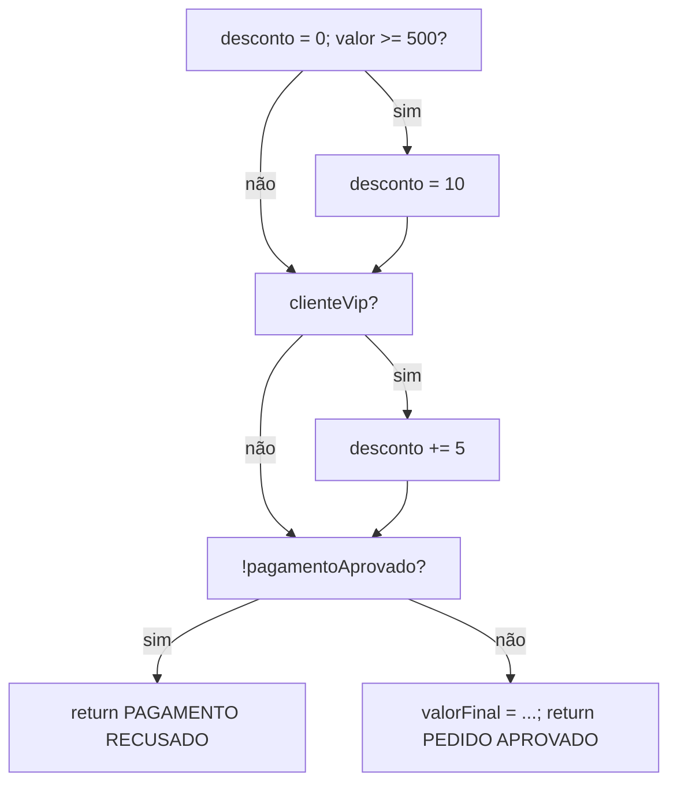
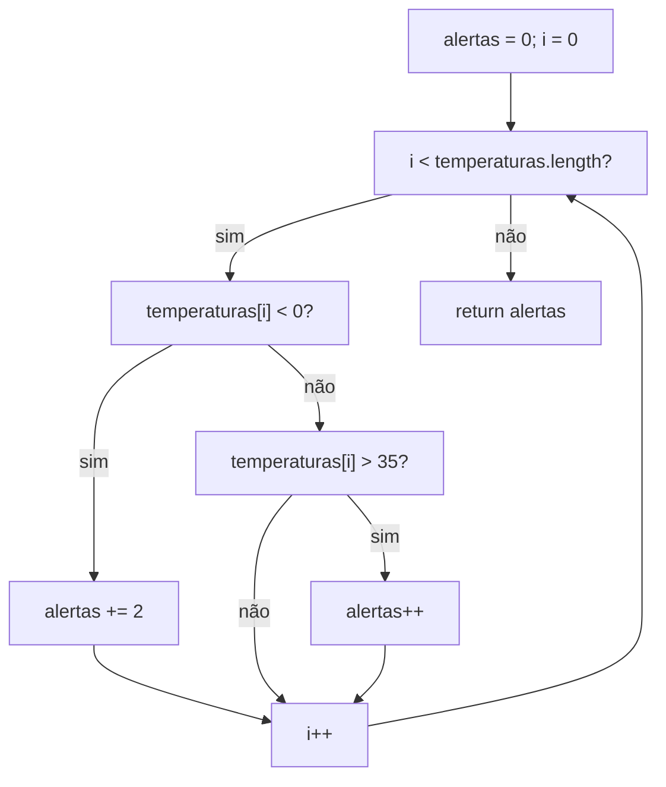

# Exercícios — Grafo de Fluxo de Controle (respostas)

## Exercício 1 — Classificação de pedido

### Blocos básicos

| Bloco | Conteúdo |
| --- | --- |
| B1 | `desconto = 0;` `if (valor >= 500)` |
| B2 | `desconto = 10;` |
| B3 | (merge) `if (clienteVip)` |
| B4 | `desconto += 5;` |
| B5 | (merge) `if (!pagamentoAprovado)` |
| B6 | `return "PAGAMENTO RECUSADO";` |
| B7 | `valorFinal = ...;` `return "PEDIDO APROVADO: " + valorFinal;` |

### Decisões

1. `valor >= 500` (B1)
2. `clienteVip` (B3)
3. `!pagamentoAprovado` (B5)

### CFG



### Contagem e complexidade

- **N (nós)** = 8 (B1, B2, B3, B4, B5, B6, B7, e o fim unificado que recebe B6 e B7)
- **E (arestas)** = 10: B1→B2, B1→B3, B2→B3, B3→B4, B3→B5, B4→B5, B5→B6, B5→B7, B6→Fim, B7→Fim

```
V(G) = E - N + 2 = 10 - 8 + 2 = 4
V(G) = decisões + 1 = 3 + 1 = 4
```

Os dois cálculos coincidem: **V(G) = 4**.

### Base de 4 caminhos independentes

| Caminho | `valor` | `clienteVip` | `pagamentoAprovado` | Resultado esperado |
| --- | --- | --- | --- | --- |
| 1 (base): B1=N, B3=N, B5=N | 100 | false | true | `"PEDIDO APROVADO: 100.0"` |
| 2: B1=S (desvio em B1) | 500 | false | true | `"PEDIDO APROVADO: 450.0"` |
| 3: B3=S (desvio em B3) | 100 | true | true | `"PEDIDO APROVADO: 95.0"` |
| 4: B5=S (desvio em B5, retorno antecipado) | 1000 | true | false | `"PAGAMENTO RECUSADO"` |

Cada caminho acrescenta exatamente uma aresta nova em relação ao caminho-base (a aresta "verdadeira" de uma das três decisões), o que caracteriza uma base de caminhos independentes.

### Questões para discussão

- **Quantas combinações entre as três condições são possíveis?** `2³ = 8` combinações de entrada (valor≥500 × clienteVip × pagamentoAprovado).
- **O número de combinações é igual à complexidade ciclomática? Explique.** Não. `V(G) = 4` é o número mínimo de caminhos *linearmente independentes* necessários para cobrir todas as arestas de decisão do grafo — não o número de combinações de valores de entrada. As 8 combinações se distribuem sobre apenas 4 caminhos estruturais porque, quando `pagamentoAprovado = false`, o resultado ("PAGAMENTO RECUSADO") é o mesmo independentemente dos valores de `valor` e `clienteVip`: 4 das 8 combinações (as que têm `pagamentoAprovado = false`) colapsam no mesmo caminho do grafo (o caminho 4).
- **Como o `return` dentro da terceira condição altera o grafo?** Ele cria uma saída antecipada (B6), fazendo o grafo ter dois pontos terminais em vez de um único `return` final. Sem esse `return`, o grafo teria uma única saída ao final do método.
- **É possível executar o cálculo de `valorFinal` quando o pagamento não foi aprovado?** Não. O `return "PAGAMENTO RECUSADO"` interrompe o fluxo antes da linha que calcula `valorFinal`; não existe aresta de B6 para B7.

---

## Exercício 2 — Análise de leituras de temperatura

### Blocos básicos

| Bloco | Conteúdo |
| --- | --- |
| B1 | `alertas = 0; i = 0;` (entrada) |
| B2 | `while (i < temperaturas.length)` (condição do laço) |
| B3 | `if (temperaturas[i] < 0)` |
| B4 | `alertas += 2;` |
| B5 | `else if (temperaturas[i] > 35)` |
| B6 | `alertas++;` |
| B7 | (merge) `i++;` — volta para B2 |
| B8 | `return alertas;` |

### Decisões

1. condição do `while` (B2)
2. `if (temperaturas[i] < 0)` (B3)
3. `else if (temperaturas[i] > 35)` (B5)

### CFG



### Contagem e complexidade

- **N (nós)** = 9 (B1 a B8, mais o fim que recebe B8)
- **E (arestas)** = 11: B1→B2, B2→B3, B2→B8, B3→B4, B3→B5, B4→B7, B5→B6, B5→B7, B6→B7, B7→B2 (retorno do laço), B8→Fim

```
V(G) = E - N + 2 = 11 - 9 + 2 = 4
V(G) = decisões + 1 = 3 + 1 = 4
```

Os dois cálculos coincidem: **V(G) = 4**.

### Base de 4 caminhos independentes

| Caminho | Vetor `temperaturas` | Ramo exercitado | Resultado esperado |
| --- | --- | --- | --- |
| 1: saída do laço sem iteração | `[]` | B2=não (0 iterações) | `0` |
| 2: temperatura negativa | `[-10]` | B2=sim, B3=sim | `2` |
| 3: temperatura acima de 35 | `[40]` | B2=sim, B3=não, B5=sim | `1` |
| 4: temperatura entre 0 e 35 (inclusive), nos dois limites | `[0, 35]` | B2=sim(×2), B3=não, B5=não | `0` |

O caminho 4 usa dois valores de fronteira (`0` e `35`) na mesma execução para comprovar que nenhum dos dois é tratado como "negativo" nem como "acima de 35" — ambos caem no ramo em que nada é somado.

### Questões para discussão

- **Um vetor com várias temperaturas percorre um único caminho ou pode repetir partes do grafo?** Repete partes do grafo: a cada iteração o fluxo volta a passar por B2→B3→(B4 ou B5→B6 ou nada)→B7→B2. Um vetor com temperaturas de classes diferentes percorre a mesma sequência de nós várias vezes, em combinações distintas a cada volta.
- **Qual entrada permite sair do método sem acessar uma posição do vetor?** Um array vazio (`temperaturas.length == 0`): a condição do `while` já é falsa na primeira avaliação, então `temperaturas[i]` nunca chega a ser lido.
- **Os testes dos valores `0` e `35` ajudam a avaliar quais fronteiras?** Confirmam os limites exatos das comparações estritas `< 0` e `> 35`: o valor `0` comprova que zero não é tratado como negativo, e o valor `35` comprova que exatamente 35 não é tratado como "superior a 35" — ambos exercitam o ramo "nenhum dos dois".
- **Por que o `else if` deve ser representado como uma nova decisão?** Porque só é avaliado quando o `if` anterior é falso, tem suas próprias saídas verdadeira/falsa e adiciona sua própria aresta de decisão ao grafo — contribuindo com +1 para `V(G)`, mesmo estando sintaticamente "dentro" do mesmo bloco condicional.
- **Por que o retorno do laço precisa aparecer no CFG?** Sem a aresta de retorno (B7→B2), o grafo não representaria a repetição do laço; a complexidade ciclomática e a cobertura de "0, 1 ou várias iterações" dependem dessa aresta existir explicitamente.
